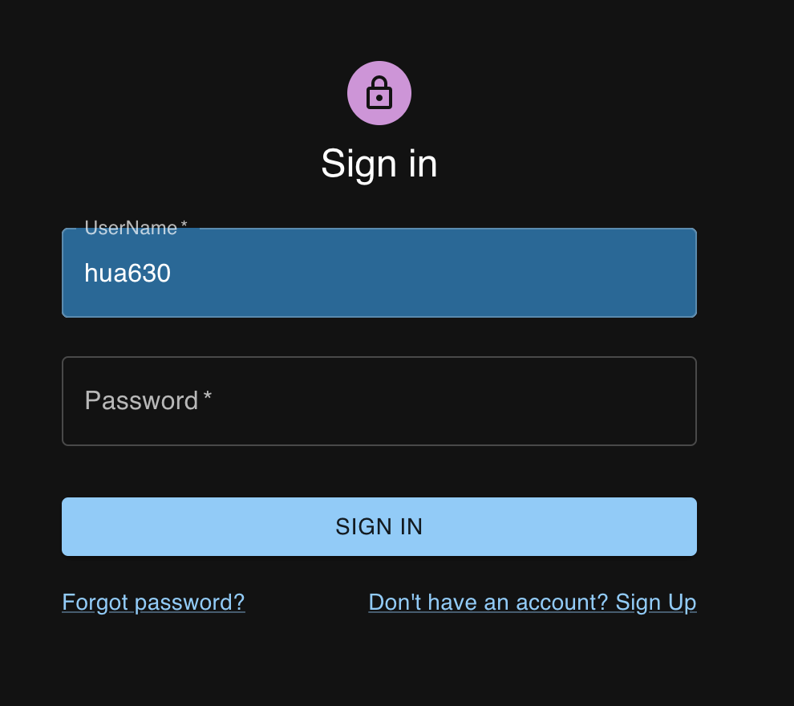
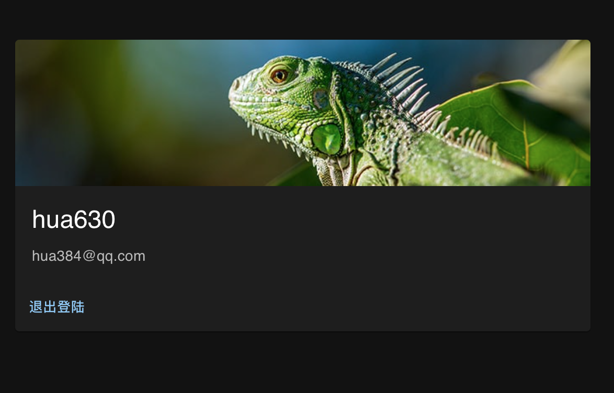
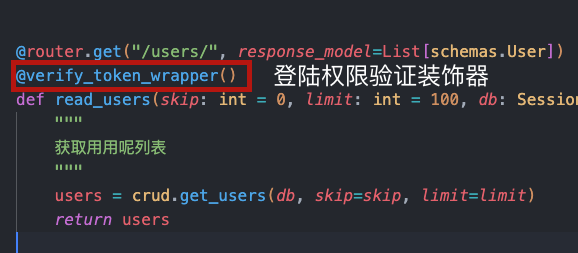

# User-OAuth2-Login是react+fastapi前后端分离OAuth2权限验证的用户登陆案例

## 简介

User-OAuth2-Login是react+fastapi前后端分离OAuth2权限验证的用户登陆案例.后端采用fastapi创建的OpenAPI接口,后端通过OAuth2的token来验证前端的登陆请求.接口处使用python的装饰器来设定那些接口需要登陆才能访问.前端采用React+Material UI布局,通过Axios访问接口获得数据和权限验证.

效果截图:

## 后端技术框架:

[fastapi](https://fastapi.tiangolo.com/zh/tutorial/)以及与其相关的`OAuth2`的安全组件库: `python-multipart`,`python-jose`,`passlib`等.

## 前端技术框架:

[React](https://react.docschina.org/docs/hello-world.html),[Axios](https://www.axios-http.cn/docs/intro),[Material UI](https://mui.com/zh/material-ui/getting-started/installation/),`react-router-dom`,`react-cookies`等.

通过这个例子,可以初步的打通web前后端分离设计理念,简单的了解后端OpenAPI接口的设计,是本人这阵子学习web的一个小小的总结.
